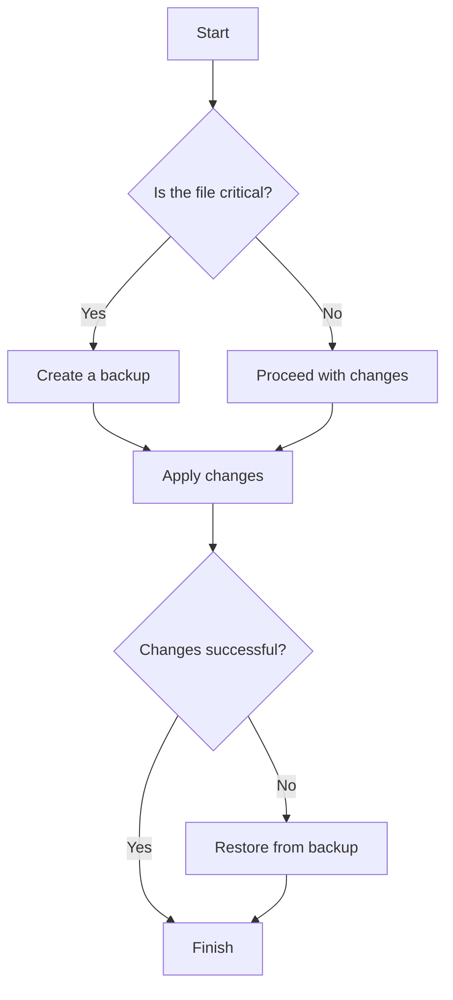
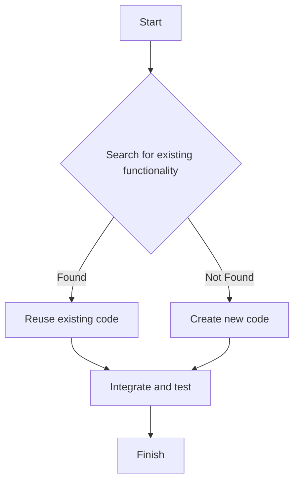
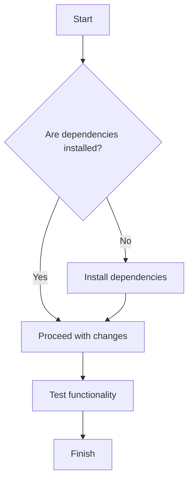
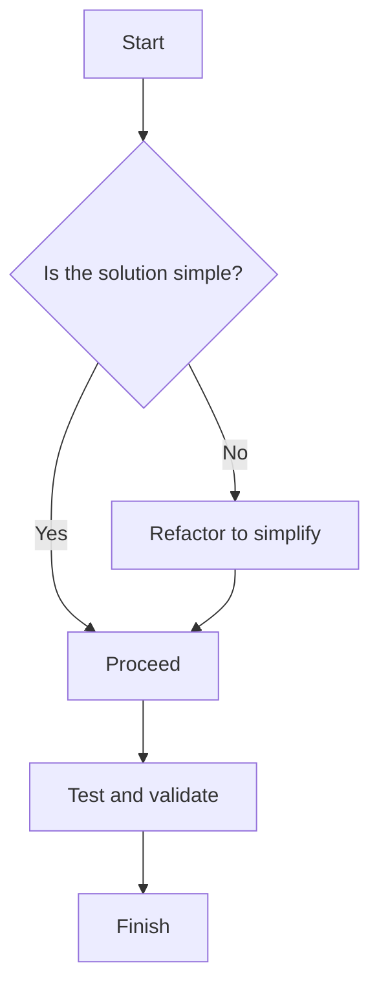
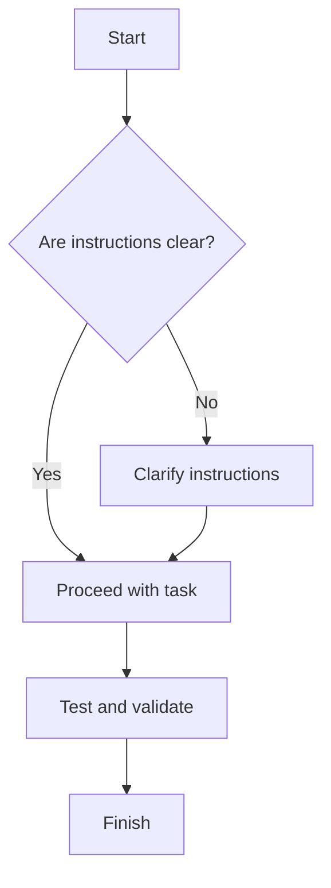
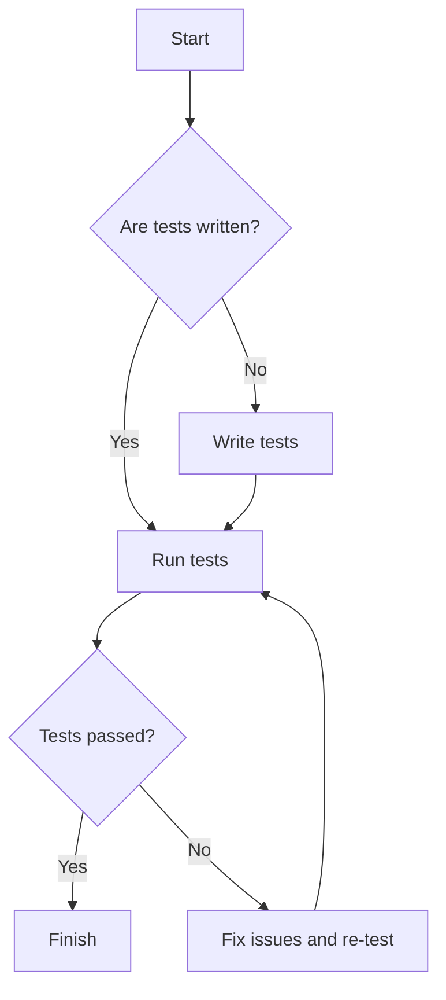
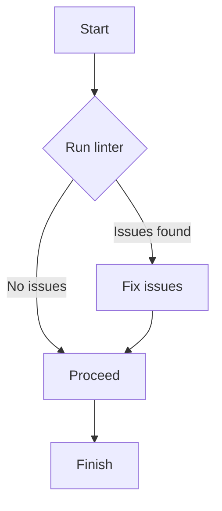
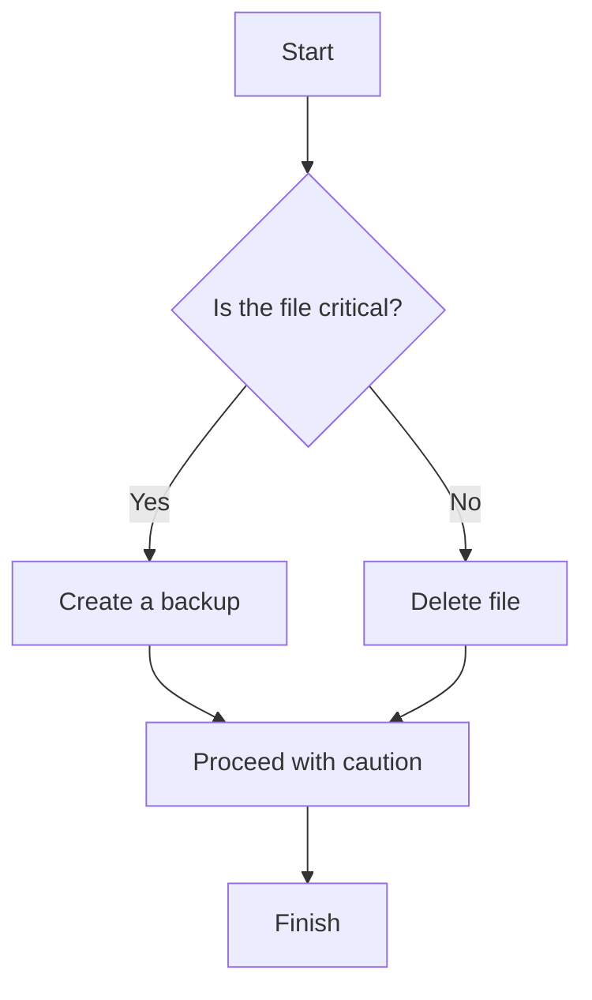
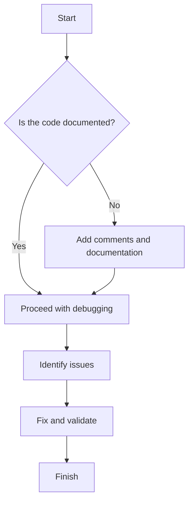
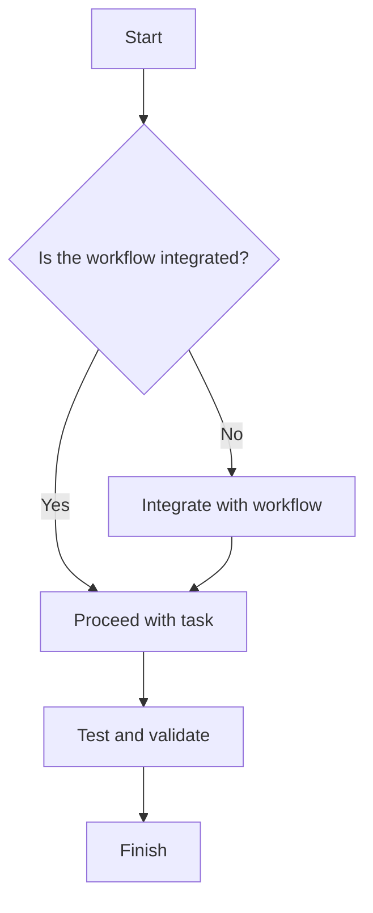

# Common Issues with AI Agents in Codebases

AI agents can be helpful but often introduce challenges. Below are common issues, solutions, and examples to address them.

## 1. Overwriting Code Instead of Making Line Changes
### Issue:
AI replaces entire sections of code, losing functionality.

### Solution:
- Use comments to indicate unchanged code.
- Validate changes with linters and tests.
- Use version control to revert mistakes.

#### Example:
```python
import os

def update_code(file_path, new_code):
    backup_path = f"{file_path}.backup"
    if os.path.exists(file_path):
        os.rename(file_path, backup_path)
    try:
        with open(file_path, 'w') as file:
            file.write(new_code)
    except Exception:
        os.rename(backup_path, file_path)
```

#### Decision Tree:


## 2. Creating New Code Instead of Modifying Existing Code
### Issue:
AI duplicates functionality instead of reusing existing code.

### Solution:
- Search for existing implementations.
- Clearly specify where changes are needed.

#### Example:
```python
import os

def find_existing(keyword, directory):
    for root, _, files in os.walk(directory):
        for file in files:
            if file.endswith('.py') and keyword in open(os.path.join(root, file)).read():
                return file
```

#### Decision Tree:


## 3. Ignoring Dependencies or Context
### Issue:
AI removes imports or breaks interdependent modules.

### Solution:
- Analyze dependencies.
- Provide sufficient context.

#### Example:
```python
import subprocess

def install_dependencies(dependencies):
    for dep in dependencies:
        subprocess.run(["pip", "install", dep], check=True)
```

#### Decision Tree:


## 4. Overcomplicating Simple Tasks
### Issue:
AI generates overly complex solutions.

### Solution:
- Simplify requirements.
- Refactor for clarity.

#### Example:
```python
# Simplified
result = sum(x**2 for x in range(10))
```

#### Decision Tree:


## 5. Misinterpreting Instructions
### Issue:
AI misunderstands vague instructions.

### Solution:
- Provide clear, detailed instructions.

#### Example:
```python
# Clear instruction
"Fix the IndexError in calculate_sum when input is empty."
```

#### Decision Tree:


## 6. Lack of Testing
### Issue:
AI introduces changes without tests.

### Solution:
- Add tests for new functionality.

#### Example:
```python
def add(a, b):
    return a + b

assert add(2, 3) == 5
```

#### Decision Tree:


## 7. Ignoring Coding Standards
### Issue:
AI generates code that violates style guides.

### Solution:
- Use linters and enforce standards.

#### Example:
```python
# Compliant
x = 42

def foo():
    print("Hello")
```

#### Decision Tree:


## 8. Overwriting or Deleting Critical Files
### Issue:
AI deletes or overwrites critical files.

### Solution:
- Backup files before changes.

#### Example:
```python
import os

def safe_delete(file_path):
    if os.path.exists(file_path):
        os.rename(file_path, f"{file_path}.backup")
```

#### Decision Tree:


## 9. Debugging AI-Generated Code
### Issue:
AI code lacks comments or uses unconventional patterns.

### Solution:
- Add comments and refactor for clarity.

#### Example:
```python
def calculate_area(radius):
    # Calculate the area of a circle
    return 3.14 * radius ** 2
```

#### Decision Tree:


## 10. Lack of Workflow Integration
### Issue:
AI changes disrupt existing workflows.

### Solution:
- Align AI with CI/CD pipelines.

#### Example:
```python
import subprocess

def run_tests():
    result = subprocess.run(["pytest"], check=False)
    if result.returncode == 0:
        print("Tests passed.")
```

#### Decision Tree:
