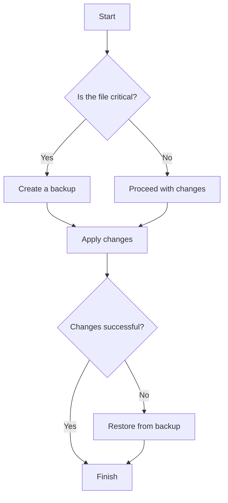
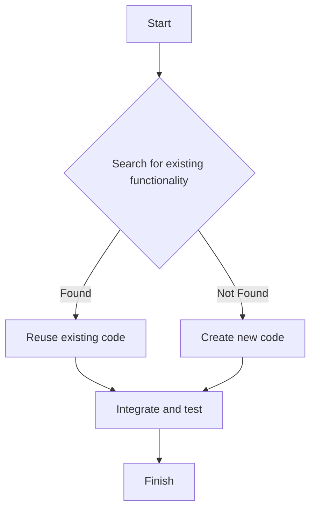
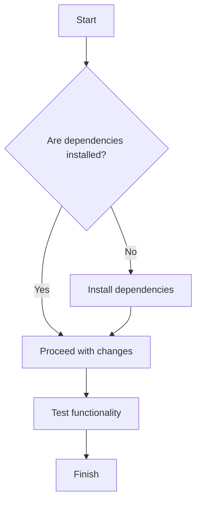
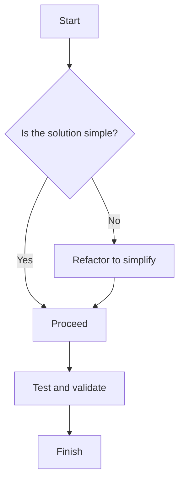
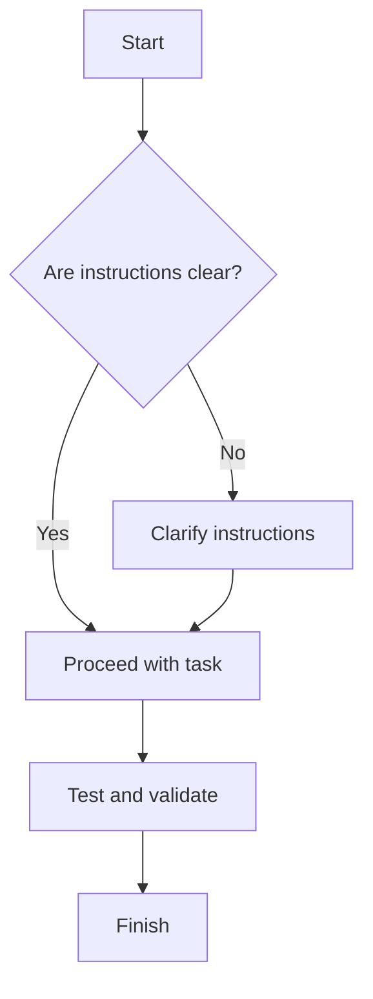
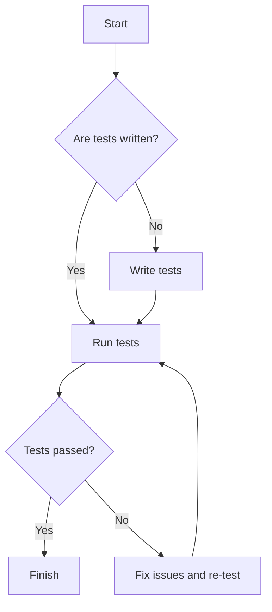
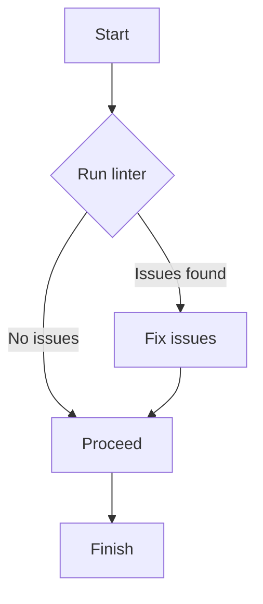
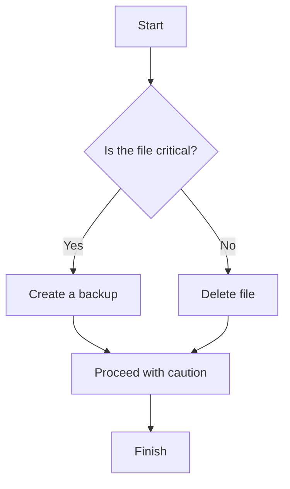
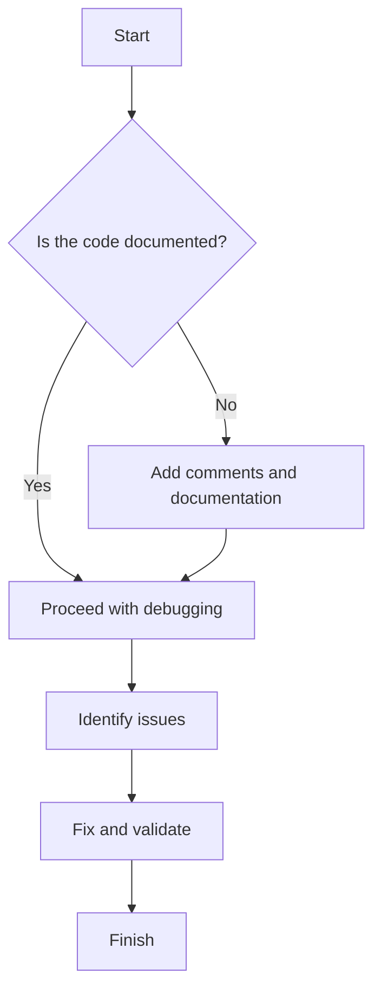
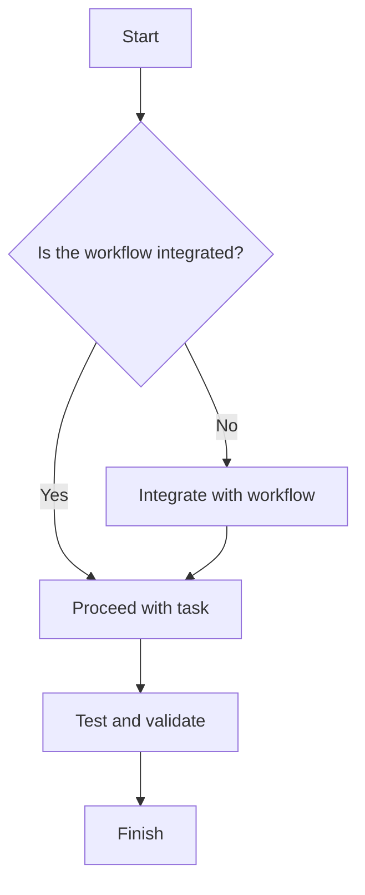

# Common Painful Issues When Using AI Agents in Codebases

AI agents can be incredibly helpful for automating tasks, but they can also introduce challenges when working with complex codebases. Below is a list of common issues and concrete steps to address them.

## 1. Overwriting Full-Fledged Code Instead of Making Line Changes
### Issue:
AI agents sometimes replace entire sections of code instead of making minimal, targeted changes. This can lead to loss of functionality or unintended side effects.

### Solution:
- **Use Comments to Represent Unchanged Code:** When editing files, use comments like `...existing code...` to indicate regions of code that should remain untouched.
- **Validate Changes:** Always validate the changes made by the AI agent using tools like linters, test suites, or manual reviews.
- **Version Control:** Ensure the codebase is under version control (e.g., Git) to easily revert unintended changes.

## 2. Creating New Code Instead of Modifying Existing Code
### Issue:
AI agents may generate new files or duplicate functionality instead of integrating changes into the existing codebase.

### Solution:
- **Search for Existing Implementations:** Use tools to search the codebase for relevant functions, classes, or files before making changes.
- **Provide Context:** Clearly specify the file and section where changes are needed.
- **Review Generated Code:** Check if the new code duplicates existing functionality and refactor as needed.

## 3. Ignoring Dependencies or Context
### Issue:
AI agents may not account for dependencies, imports, or the broader context of the codebase, leading to broken functionality.

### Solution:
- **Dependency Analysis:** Use tools to analyze dependencies and ensure they are correctly handled.
- **Context Gathering:** Provide the AI agent with sufficient context about the codebase, including related files and modules.
- **Testing:** Run tests to verify that changes do not break existing functionality.

## 4. Overcomplicating Simple Tasks
### Issue:
AI agents may generate overly complex solutions for simple problems, making the code harder to maintain.

### Solution:
- **Simplify Requirements:** Clearly define the task and emphasize simplicity.
- **Code Reviews:** Review the generated code to ensure it is concise and maintainable.
- **Refactoring:** Simplify the code if it is unnecessarily complex.

## 5. Misinterpreting Instructions
### Issue:
AI agents may misunderstand vague or ambiguous instructions, leading to incorrect or incomplete changes.

### Solution:
- **Be Specific:** Provide clear, detailed instructions with examples if possible.
- **Iterative Feedback:** Review the changes and provide feedback to refine the output.
- **Test Cases:** Use test cases to validate the changes and ensure they meet the requirements.

## 6. Lack of Testing
### Issue:
AI agents may not automatically generate or run tests for the changes they make, increasing the risk of introducing bugs.

### Solution:
- **Test Automation:** Integrate automated testing into the workflow to catch issues early.
- **Test Coverage:** Ensure that new changes are covered by tests.
- **Manual Testing:** Perform manual testing for critical functionality.

## 7. Ignoring Coding Standards
### Issue:
AI agents may generate code that does not adhere to the coding standards or style guidelines of the project.

### Solution:
- **Linting Tools:** Use linting tools to enforce coding standards.
- **Code Reviews:** Review the generated code for adherence to style guidelines.
- **Predefined Templates:** Provide the AI agent with templates or examples that follow the project’s coding standards.

## 8. Overwriting or Deleting Critical Files
### Issue:
AI agents may overwrite or delete critical files, leading to data loss or broken functionality.

### Solution:
- **Backup Files:** Create backups of critical files before making changes.
- **Version Control:** Use version control to track changes and revert if necessary.
- **Restrict Access:** Limit the AI agent’s access to critical files unless explicitly required.

## 9. Difficulty in Debugging AI-Generated Code
### Issue:
AI-generated code can be difficult to debug, especially if it is not well-documented or follows unconventional patterns.

### Solution:
- **Documentation:** Ensure the AI agent generates comments or documentation for the code.
- **Debugging Tools:** Use debugging tools to step through the code and identify issues.
- **Refactoring:** Refactor the code to improve readability and maintainability.

## 10. Lack of Integration with Existing Workflows
### Issue:
AI agents may not integrate well with existing development workflows, causing disruptions.

### Solution:
- **Workflow Alignment:** Configure the AI agent to align with the team’s development workflow.
- **Tool Integration:** Integrate the AI agent with tools like CI/CD pipelines, issue trackers, and code review platforms.
- **Training:** Train the team on how to effectively use the AI agent within the workflow.

## Additional Situations for Each Issue

### 1. Overwriting Full-Fledged Code Instead of Making Line Changes
- **Scenario:** AI agent replaces a critical algorithm with a generic implementation, losing optimization.
- **Scenario:** Entire configuration files are overwritten, breaking environment-specific settings.

### 2. Creating New Code Instead of Modifying Existing Code
- **Scenario:** Duplicate utility functions are created instead of reusing existing ones.
- **Scenario:** New database migration scripts are generated instead of updating existing ones.

### 3. Ignoring Dependencies or Context
- **Scenario:** AI agent removes imports, causing runtime errors.
- **Scenario:** Changes are made without considering interdependent modules, leading to cascading failures.

### 4. Overcomplicating Simple Tasks
- **Scenario:** A simple loop is replaced with a recursive function, increasing complexity.
- **Scenario:** AI generates a multi-class structure for a task solvable with a single function.

### 5. Misinterpreting Instructions
- **Scenario:** AI agent adds logging instead of fixing a bug due to vague instructions.
- **Scenario:** Incorrect file is modified because the file path was ambiguous.

### 6. Lack of Testing
- **Scenario:** AI agent introduces changes without adding tests, reducing test coverage.
- **Scenario:** Generated code passes unit tests but fails integration tests due to untested edge cases.

### 7. Ignoring Coding Standards
- **Scenario:** AI agent uses inconsistent naming conventions, making the code harder to read.
- **Scenario:** Generated code violates PEP-8 or other style guides, requiring manual cleanup.

### 8. Overwriting or Deleting Critical Files
- **Scenario:** AI agent deletes a `.env` file, exposing sensitive data.
- **Scenario:** Critical deployment scripts are overwritten, causing production downtime.

### 9. Difficulty in Debugging AI-Generated Code
- **Scenario:** AI agent generates code with no comments, making debugging time-consuming.
- **Scenario:** Generated code uses unconventional patterns, confusing team members.

### 10. Lack of Integration with Existing Workflows
- **Scenario:** AI agent generates code incompatible with the CI/CD pipeline.
- **Scenario:** Changes are made without updating related documentation or issue trackers.

## Enhanced Aids for Each Issue

### 1. Overwriting Full-Fledged Code Instead of Making Line Changes
#### Code Example
```python
# Example: Safeguarding against overwriting critical code
import os

def update_code(file_path, new_code):
    backup_path = f"{file_path}.backup"
    if os.path.exists(file_path):
        os.rename(file_path, backup_path)
        print(f"Backup created: {backup_path}")
    try:
        with open(file_path, 'w') as file:
            file.write(new_code)
        print("Code updated successfully.")
    except Exception as e:
        os.rename(backup_path, file_path)
        print(f"Error occurred. Restored from backup: {e}")
```

#### Decision Tree


### 2. Creating New Code Instead of Modifying Existing Code
#### Code Example
```python
# Example: Searching for existing functionality before creating new code
import os

def find_existing_functionality(keyword, directory):
    for root, _, files in os.walk(directory):
        for file in files:
            if file.endswith('.py'):
                with open(os.path.join(root, file)) as f:
                    if keyword in f.read():
                        print(f"Found existing functionality in {file}")
                        return
    print("No existing functionality found. Proceeding to create new code.")
```

#### Decision Tree


### 3. Ignoring Dependencies or Context
#### Code Example
```python
# Example: Ensuring dependencies are handled
import subprocess

def install_dependencies(dependencies):
    for dep in dependencies:
        try:
            subprocess.run(["pip", "install", dep], check=True)
            print(f"Installed {dep}")
        except subprocess.CalledProcessError as e:
            print(f"Failed to install {dep}: {e}")

install_dependencies(["requests", "flask"])
```

#### Decision Tree


### 4. Overcomplicating Simple Tasks
#### Code Example
```python
# Example: Simplifying a task
# Overcomplicated
result = sum([x**2 for x in range(10)])

# Simplified
result = sum(x**2 for x in range(10))
print(result)
```

#### Decision Tree


### 5. Misinterpreting Instructions
#### Code Example
```python
# Example: Providing clear instructions
# Ambiguous
# "Fix the bug in the function."

# Clear
# "Fix the IndexError in the calculate_sum function when the input is an empty list."
```

#### Decision Tree


### 6. Lack of Testing
#### Code Example
```python
# Example: Adding tests for new functionality
def add(a, b):
    return a + b

# Test
assert add(2, 3) == 5
assert add(-1, 1) == 0
print("All tests passed.")
```

#### Decision Tree


### 7. Ignoring Coding Standards
#### Code Example
```python
# Example: Enforcing coding standards
# Non-compliant
x=  42

def foo ( ):
    print( "Hello" )

# Compliant
x = 42

def foo():
    print("Hello")
```

#### Decision Tree


### 8. Overwriting or Deleting Critical Files
#### Code Example
```python
# Example: Safeguarding critical files
import os

def safe_delete(file_path):
    if os.path.exists(file_path):
        backup_path = f"{file_path}.backup"
        os.rename(file_path, backup_path)
        print(f"Backup created: {backup_path}")
    else:
        print("File does not exist.")

safe_delete("critical_config.yaml")
```

#### Decision Tree


### 9. Difficulty in Debugging AI-Generated Code
#### Code Example
```python
# Example: Adding comments to AI-generated code
def calculate_area(radius):
    # Calculate the area of a circle given its radius
    return 3.14 * radius ** 2

print(calculate_area(5))
```

#### Decision Tree


### 10. Lack of Integration with Existing Workflows
#### Code Example
```python
# Example: Integrating with CI/CD pipeline
# Add a script to run tests before deployment
import subprocess

def run_tests():
    result = subprocess.run(["pytest", "--maxfail=1"], check=False)
    if result.returncode == 0:
        print("All tests passed. Proceeding with deployment.")
    else:
        print("Tests failed. Aborting deployment.")

run_tests()
```

#### Decision Tree


By addressing these issues, you can maximize the benefits of using AI agents while minimizing potential drawbacks.