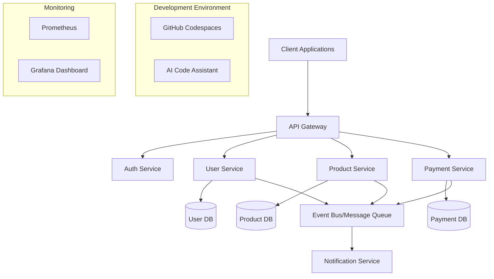
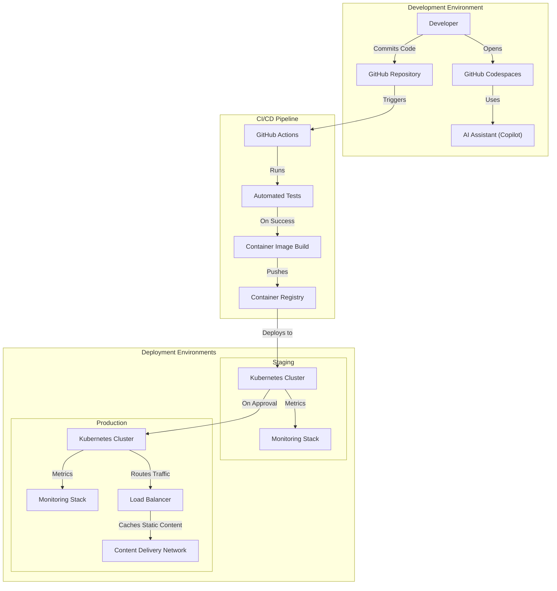
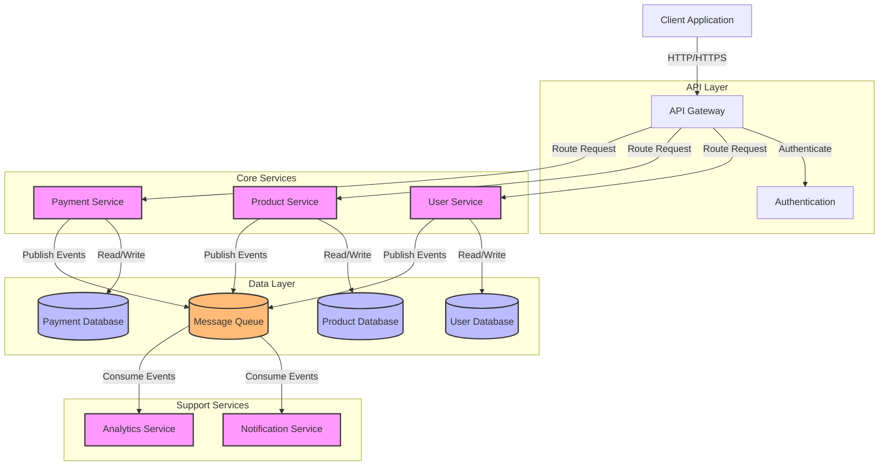

# Building Complex Microservices Applications with GitHub Codespaces and AI

## Architecture Overview

A typical microservices architecture built with Codespaces and AI assistance employs the following structure:

```
project-root/
├── .devcontainer/                  # Codespaces configuration
│   ├── devcontainer.json           # Main configuration
│   ├── docker-compose.yml          # Multi-container setup
│   └── Dockerfile                  # Dev environment definition
├── services/                       # Individual microservices
│   ├── user-service/
│   ├── payment-service/
│   ├── notification-service/
│   └── product-service/
├── infrastructure/                 # Infrastructure as code
│   ├── kubernetes/
│   ├── terraform/
│   └── monitoring/
├── gateway/                        # API Gateway
├── shared/                         # Shared libraries/utilities
└── docs/                           # Documentation
```

## Architectural Diagram

This diagram represents the high-level architecture of a microservices application:



## Implementation Strategy

### 1. GitHub Codespaces Setup

First, create a comprehensive Codespaces configuration:

```json
// .devcontainer/devcontainer.json
{
  "name": "Microservices Project",
  "dockerComposeFile": "docker-compose.yml",
  "service": "development",
  "workspaceFolder": "/workspace",
  "settings": {
    "terminal.integrated.shell.linux": "/bin/bash"
  },
  "extensions": [
    "ms-azuretools.vscode-docker",
    "github.copilot",
    "ms-kubernetes-tools.vscode-kubernetes-tools",
    "redhat.vscode-yaml",
    "dbaeumer.vscode-eslint",
    "esbenp.prettier-vscode"
  ],
  "forwardPorts": [3000, 4000, 5000, 8080, 9090],
  "postCreateCommand": "bash .devcontainer/post-create.sh"
}
```

Docker Compose setup to run the entire stack locally:

```yaml
# .devcontainer/docker-compose.yml
version: '3.8'

services:
  development:
    build:
      context: .
      dockerfile: Dockerfile
    volumes:
      - ..:/workspace:cached
    command: sleep infinity
    networks:
      - microservices-network

  mongodb:
    image: mongo:latest
    restart: unless-stopped
    volumes:
      - mongodb-data:/data/db
    networks:
      - microservices-network

  redis:
    image: redis:alpine
    restart: unless-stopped
    volumes:
      - redis-data:/data
    networks:
      - microservices-network

  kafka:
    image: confluentinc/cp-kafka:latest
    depends_on:
      - zookeeper
    environment:
      KAFKA_BROKER_ID: 1
      KAFKA_ZOOKEEPER_CONNECT: zookeeper:2181
      KAFKA_ADVERTISED_LISTENERS: PLAINTEXT://kafka:9092
      KAFKA_OFFSETS_TOPIC_REPLICATION_FACTOR: 1
    networks:
      - microservices-network

  zookeeper:
    image: confluentinc/cp-zookeeper:latest
    environment:
      ZOOKEEPER_CLIENT_PORT: 2181
    networks:
      - microservices-network

networks:
  microservices-network:
    driver: bridge

volumes:
  mongodb-data:
  redis-data:
```

### 2. Service Template

Create a standardized service template that AI tools can recognize and help extend:

```javascript
// services/template-service/src/index.js
const express = require('express');
const { connect } = require('./db');
const { setupEventListeners } = require('./events');
const { serviceLogger } = require('../../shared/logging');
const routes = require('./routes');
const config = require('./config');

/**
 * TEMPLATE-SERVICE
 * 
 * PURPOSE: [AI: Replace with specific service purpose]
 * DEPENDENCIES: MongoDB, Redis, Kafka
 * ENDPOINTS: [AI: List key endpoints]
 */
async function startService() {
  const app = express();
  
  // Middleware setup
  app.use(express.json());
  app.use(serviceLogger);
  
  // Routes
  app.use('/api', routes);
  
  // Connect to database
  await connect(config.databaseUrl);
  
  // Setup event listeners
  setupEventListeners();
  
  // Start server
  app.listen(config.port, () => {
    console.log(`Service running on port ${config.port}`);
  });
}

startService().catch(err => {
  console.error('Failed to start service:', err);
  process.exit(1);
});
```

### 3. Service Communication Pattern

Implement a consistent communication pattern across services:

```javascript
// shared/communication/index.js
const axios = require('axios');
const { getServiceUrl } = require('./service-discovery');

/**
 * AI-ASSIST-PATTERN: Standard service communication function
 * Used across all microservices for consistent inter-service communication
 */
async function callService(serviceName, endpoint, method = 'GET', data = null) {
  try {
    const serviceUrl = await getServiceUrl(serviceName);
    const url = `${serviceUrl}${endpoint}`;
    
    const response = await axios({
      method,
      url,
      data,
      headers: {
        'Content-Type': 'application/json',
        'X-Correlation-Id': getCurrentCorrelationId()
      }
    });
    
    return response.data;
  } catch (error) {
    console.error(`Error calling ${serviceName} service:`, error);
    throw new Error(`Service communication error: ${error.message}`);
  }
}

function getCurrentCorrelationId() {
  // Get correlation ID from current context
  return process.context?.correlationId || generateNewCorrelationId();
}

function generateNewCorrelationId() {
  return `corr-${Date.now()}-${Math.random().toString(36).substring(2, 10)}`;
}

module.exports = {
  callService
};
```

### 4. Event-Based Communication

Implement a standard event handling system:

```javascript
// shared/events/index.js
const { Kafka } = require('kafkajs');
const kafka = new Kafka({
  clientId: process.env.SERVICE_NAME,
  brokers: process.env.KAFKA_BROKERS.split(',')
});

const producer = kafka.producer();
const consumer = kafka.consumer({ groupId: process.env.SERVICE_NAME });

/**
 * AI-ASSIST-PATTERN: Standard event publishing
 * Used for publishing events to the message bus
 */
async function publishEvent(eventType, data) {
  await producer.connect();
  
  await producer.send({
    topic: eventType,
    messages: [
      { value: JSON.stringify({
        eventType,
        timestamp: new Date().toISOString(),
        producer: process.env.SERVICE_NAME,
        correlationId: getCurrentCorrelationId(),
        data
      }) }
    ]
  });
}

/**
 * AI-ASSIST-PATTERN: Standard event subscription
 * Used for subscribing to events from the message bus
 */
async function subscribeToEvent(eventType, handler) {
  await consumer.connect();
  await consumer.subscribe({ topic: eventType });
  
  await consumer.run({
    eachMessage: async ({ topic, partition, message }) => {
      const event = JSON.parse(message.value.toString());
      
      // Set correlation ID in current context
      setCorrelationId(event.correlationId);
      
      try {
        await handler(event.data, event);
      } catch (error) {
        console.error(`Error handling event ${eventType}:`, error);
      }
    }
  });
}

module.exports = {
  publishEvent,
  subscribeToEvent
};
```

### 5. AI-Enhanced Development Workflow

Create special files to guide AI assistance:

```markdown
# service-patterns.md

## Service Implementation Patterns

### REST API Controller Pattern
```javascript
// PATTERN: Standard controller with validation and error handling
async function controllerFunction(req, res) {
  try {
    // 1. Validate input
    const { error, value } = validateSchema(req.body);
    if (error) return res.status(400).json({ error: error.details[0].message });
    
    // 2. Call business logic
    const result = await businessLogicFunction(value);
    
    // 3. Return response
    return res.status(200).json(result);
  } catch (error) {
    // 4. Handle errors
    if (error.type === 'NotFound') {
      return res.status(404).json({ error: error.message });
    }
    console.error('Controller error:', error);
    return res.status(500).json({ error: 'Internal server error' });
  }
}
```

### Database Access Pattern
```javascript
// PATTERN: Repository pattern with connection handling
async function findByProperty(property, value) {
  const collection = await getCollection('collectionName');
  
  try {
    const result = await collection.findOne({ [property]: value });
    return result;
  } catch (error) {
    console.error('Database error:', error);
    throw new DatabaseError('Failed to fetch from database', error);
  }
}
```
```

### 6. Testing Strategy

Implement consistent testing approach across services:

```javascript
// services/user-service/tests/user.test.js
const request = require('supertest');
const { app } = require('../src/app');
const { connectTestDb, clearTestDb, closeTestDb } = require('./test-utils');

/**
 * AI-ASSIST-PATTERN: Standard integration test structure
 * Following AAA pattern: Arrange, Act, Assert
 */
describe('User Service API', () => {
  // Setup and teardown
  beforeAll(async () => {
    await connectTestDb();
  });
  
  afterEach(async () => {
    await clearTestDb();
  });
  
  afterAll(async () => {
    await closeTestDb();
  });
  
  describe('POST /api/users', () => {
    it('should create a new user', async () => {
      // Arrange
      const userData = {
        email: 'test@example.com',
        name: 'Test User',
        password: 'securePassword123'
      };
      
      // Act
      const response = await request(app)
        .post('/api/users')
        .send(userData)
        .expect(201);
      
      // Assert
      expect(response.body).toHaveProperty('id');
      expect(response.body.email).toBe(userData.email);
      expect(response.body.name).toBe(userData.name);
      expect(response.body).not.toHaveProperty('password');
    });
  });
});
```

### 7. CI/CD Pipeline for Microservices

Configure GitHub Actions for CI/CD:

```yaml
# .github/workflows/service-ci.yml
name: Microservice CI

on:
  push:
    paths:
      - 'services/**'
      - 'shared/**'
      - '.github/workflows/service-ci.yml'

jobs:
  detect-changes:
    runs-on: ubuntu-latest
    outputs:
      services: ${{ steps.filter.outputs.changes }}
    steps:
      - uses: actions/checkout@v3
      - id: filter
        uses: dorny/paths-filter@v2
        with:
          filters: |
            user-service:
              - 'services/user-service/**'
              - 'shared/**'
            payment-service:
              - 'services/payment-service/**'
              - 'shared/**'
            product-service:
              - 'services/product-service/**'
              - 'shared/**'
            notification-service:
              - 'services/notification-service/**'
              - 'shared/**'

  test-service:
    needs: detect-changes
    if: ${{ needs.detect-changes.outputs.services != '[]' }}
    strategy:
      matrix:
        service: ${{ fromJSON(needs.detect-changes.outputs.services) }}
    runs-on: ubuntu-latest
    steps:
      - uses: actions/checkout@v3
      - name: Set up Node.js
        uses: actions/setup-node@v3
        with:
          node-version: '16'
      - name: Install dependencies
        run: cd services/${{ matrix.service }} && npm install
      - name: Run tests
        run: cd services/${{ matrix.service }} && npm test
      
  build-and-push:
    needs: test-service
    strategy:
      matrix:
        service: ${{ fromJSON(needs.detect-changes.outputs.services) }}
    runs-on: ubuntu-latest
    steps:
      - uses: actions/checkout@v3
      
      - name: Login to Container Registry
        uses: docker/login-action@v2
        with:
          registry: ghcr.io
          username: ${{ github.actor }}
          password: ${{ secrets.GITHUB_TOKEN }}
      
      - name: Build and push
        uses: docker/build-push-action@v4
        with:
          context: ./services/${{ matrix.service }}
          push: true
          tags: ghcr.io/${{ github.repository }}/${{ matrix.service }}:latest
```

### 8. Monitoring and Observability

Implement consistent monitoring across services:

```javascript
// shared/monitoring/index.js
const prometheus = require('prom-client');
const register = new prometheus.Registry();

// Add default metrics
prometheus.collectDefaultMetrics({ register });

// Define custom metrics
const httpRequestDurationMicroseconds = new prometheus.Histogram({
  name: 'http_request_duration_ms',
  help: 'Duration of HTTP requests in ms',
  labelNames: ['method', 'route', 'code'],
  buckets: [0.1, 5, 15, 50, 100, 500]
});

const httpRequestCounter = new prometheus.Counter({
  name: 'http_requests_total',
  help: 'Total number of HTTP requests',
  labelNames: ['method', 'route', 'code']
});

// Register metrics
register.registerMetric(httpRequestDurationMicroseconds);
register.registerMetric(httpRequestCounter);

// Middleware for Express
function metricsMiddleware(req, res, next) {
  const start = Date.now();
  
  res.on('finish', () => {
    const duration = Date.now() - start;
    const path = req.route ? req.route.path : req.path;
    
    httpRequestDurationMicroseconds
      .labels(req.method, path, res.statusCode)
      .observe(duration);
    
    httpRequestCounter
      .labels(req.method, path, res.statusCode)
      .inc();
  });
  
  next();
}

// Metrics endpoint
function metricsEndpoint(app) {
  app.get('/metrics', async (req, res) => {
    res.set('Content-Type', register.contentType);
    res.end(await register.metrics());
  });
}

module.exports = {
  metricsMiddleware,
  metricsEndpoint,
  register
};
```

## Effective AI Collaboration Practices

1. **Service Generation Templates**: Use AI to generate new microservices from templates with consistent patterns

2. **AI-Directed Comments**: Add special comments that guide AI to understand architecture:
   ```javascript
   // AI-CONTEXT: This service communicates with payment-service via Kafka events
   // AI-PATTERN: Repository pattern implementation
   // AI-RELATION: Used by user-service for authentication
   ```

3. **Architecture Decision Records (ADRs)**: Document major decisions for AI context:
   ```markdown
   # ADR-001: Service Communication Pattern
   
   ## Context
   We need a standardized way for microservices to communicate.
   
   ## Decision
   We will use both synchronous (REST) and asynchronous (Kafka) communication.
   
   ## Consequences
   * Increased reliability through event-driven architecture
   * Added complexity in maintaining event consistency
   ```

4. **AI-Assisted Debugging**: Create debugging playbooks for common issues:
   ```markdown
   # Debugging Guide: Service Communication Failures
   
   ## Symptoms
   - 503 Service Unavailable errors
   - Timeout errors in service calls
   
   ## Diagnosis Steps
   1. Check if target service is running: `kubectl get pods`
   2. Check service logs: `kubectl logs <pod-name>`
   3. Verify network policies allow communication
   
   ## Common Solutions
   - Scale service if under heavy load
   - Check for database connection issues
   - Verify proper service discovery configuration
   ```

## Project Evolution and Scaling

1. **Service Boundaries Definition**:
   - Use Domain-Driven Design (DDD) to identify bounded contexts
   - Document domain models to help AI understand relationships
   - Create clear interface definitions between services

2. **Gradual Complexity Introduction**:
   - Start with monolithic development and extract microservices
   - Use feature flags to control deployment of new services
   - Document migration patterns for AI to follow

3. **Code Complexity Management**:
   - Use consistent patterns that AI can recognize across services
   - Implement metadata and annotations that help AI understand domain concepts
   - Create visualization tools to understand service dependencies

## Best Practices

1. **Consistent Environment Management**: 
   - Use Codespaces environment variables for service discovery
   - Implement .env templates for each service
   - Document environment setup for new developers

2. **Documentation as Code**:
   - Keep API documentation next to implementation
   - Use OpenAPI specifications for all services
   - Generate documentation from code comments

3. **Testing Pyramid Implementation**:
   - Unit tests for business logic
   - Integration tests for API endpoints
   - Contract tests between services
   - End-to-end tests for critical paths

4. **Security Implementation**:
   - Consistent authentication across services
   - Authorization patterns in shared libraries
   - Security headers and middleware standardization

## Microservices application deployment workflow



## Microservices communication pattern


